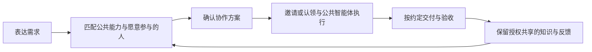

# 科研智能体平台 · Research Agent Platform

**B0 更新（2026-09-21）**：新增[可执行契约 0.1.0](packages/contracts/README.md)、[最小 API / 事务库基础与启动说明](docs/development/b0-architecture.md)。仅健康检查已可调用；账号与任务接口尚未实施，Harness 仍受安装阻塞。下文原有产品规划不代表 B1–B4 已交付。根 CI 现覆盖契约、API 和两个原有包，另含生成契约一致性和真实服务进程检查。

从一句话需求开始，匹配人与智能体的能力，确认协作方案并推进任务，让结果与获准共享的经验帮助下一次工作。

我们从自己小组的真实科研工作开始：写论文、准备项目申请书、整理材料、安排科研实习生和跟踪任务。小组成员通过浏览器访问同一个平台，智能体任务在常开服务器上执行；经过组内验证后，再沿相似需求和科研合作关系推广。

**产品形态是任务与能力匹配平台，拟定技术路线是 DeepSeek Harness 运行底座＋科研插件＋团队服务。** 前台保持一个简洁入口，后台管理任务分配与协作。能力分公共与个人私有：成员可以使用自有方法交付，不必把个人能力向任务负责人或其他成员开放。

> 当前处于产品规划与工程起步阶段。仓库已迁入本地项目/成果存储核心、十项科研 Skills、评测材料和 Harness 适配源码。统一网页、团队账号、任务匹配与分配、公共/私有能力权限、长期记忆和后台调度尚未实现。当前可独立运行的是基础检查和本地演示。本轮更新设计文档，没有实现后端或界面。

## 为什么要做

我们希望验证三个问题：

1. AI 能否帮助研究者把零散、未想清楚的事情组织成可修改、可接受的协作方案？
2. 匹配公共能力和愿意承接的成员后，能否减少漏事、催问、重复解释和交接负担，同时保护个人方法？
3. 在真实任务中，授权共享的知识、公共能力和个人能力能否分别改进，让下一次工作更容易？

先在自己的小组验证人与智能体共同完成任务。公共能力由维护者或愿意贡献的成员建设；个人保持能力私有同样可以参与协作。向其他课题组扩展、外部能力供给和付费意愿需要后续单独验证。

## 我们希望第一版怎样工作

使用者说出“我有一份科研项目申请书要写”，AI 利用有权使用的背景，说明需要哪些能力、本人要判断什么、公共智能体可以做什么、哪些部分可以邀请成员或开放认领。用户修改并确认方案后，后台更新任务。参与者接受后用自己的方式工作，只需提交约定的成果与依据；进度、待判断项和验收回到同一上下文。



个人私有能力只在所有者或其明确授权的范围使用，不进入其他成员的匹配上下文。公共能力缺失时，可以由人承担、接入现有能力或自愿建设新智能体。完成共享任务不自动授权平台公开个人方法或抽取为公共 Skill。

十项已有 Skills 是候选资产，不预设全部成为首发智能体。详细范围见[产品规划 v0.3](docs/product-plan.md)，方案确认、任务承接、状态和私有边界见[任务分配设计](docs/task-allocation.md)，实际价值如何验证见[试点计划](docs/validation-plan.md)，推进顺序见[路线图](docs/roadmap.md)。

简洁入口、实验室任务总览和任务详情的视觉方向已初步确认，见[九张界面图](docs/design/README.md)。下一步开发从[第一版交接说明](docs/development-handoff.md)开始，统一接口与状态后分批实现；设计图中的任务与执行状态均为示例。

前后端分工直接使用[分阶段开发文档](docs/development/README.md)，其中有各自开发指南、共同接口约定、逐阶段验收案例和[第一步启动 prompt](docs/development/prompts.md)。

## 当前有什么

| 内容 | 状态 | 实际边界 |
|---|---|---|
| [科研数据核心](packages/research-core/README.md) | 已迁入，可独立构建与测试 | 本地 Project / Artifact 存取、来源信息、状态和哈希；无团队权限和跨进程事务 |
| [科研 Skills](agents/README.md) | 十项完整方法与参考材料，构建时统一打包 | 定义做事方法；执行仍需要相应检索、解析、分析等工具 |
| [Skills 加载包](packages/research-skills/README.md) | 可独立构建与测试 | 从同一份 Skill 源文件加载正文与本地参考目录 |
| [评测材料](evaluations/matrix.md) | 已迁入人工评测场景 | 不等于已完成模型效果评测；部分成功场景仍待补充 |
| [Harness 适配](integrations/deepseek-harness/README.md) | 迁入并调整源码，待完整联调 | 不进入默认构建；旧 SDK 版本及公开包依赖链存在安装问题 |
| 网页、任务分配、成员及能力权限、长期记忆、后台调度 | 规划中 | 尚未实现或部署 |

目前不会自动执行论文搜索、PDF 解析、引用验证或实验，也没有可登录的团队网页。目录和界面探索的取舍记录在[迁移说明](docs/migration.md)。

## 本地开始

建议 Node.js 24；要求 Node.js ≥ 22.19，pnpm 11.21.0。

```sh
git clone https://github.com/luoyan96/research-agent-platform.git
cd research-agent-platform
pnpm install --frozen-lockfile
pnpm run ci
pnpm demo
```

`pnpm run ci` 检查文档和 Skills 引用，构建两个基础包，执行类型检查与单元测试。`pnpm demo` 在系统临时目录创建演示项目、保存一份计划、通过新存储实例重新读取，并列出十项 Skills。演示打印文件位置，便于查看；不调用模型，不需要 API key。

Harness 源码适配单独位于 `integrations/deepseek-harness/`。主仓库的构建通过不代表 Harness 联调已经通过，接入状态和验证步骤见该目录 README。

## 仓库结构

```text
agents/                     十项 Skills 的唯一源文件、共享模板
packages/research-core/      不依赖 Harness 的科研对象与本地存储
packages/research-skills/    Skills 加载与打包
integrations/deepseek-harness/  可继续联调的 Harness 插件源码
evaluations/                人工评测矩阵与失败/边界案例
docs/                       产品规划、任务分配、试点验证、路线图、架构和迁移记录
scripts/                    内容检查、资源打包和本地演示
.github/                    基础检查流程与协作模板
```

平台网页和服务将在对应里程碑建立；当前没有用占位页面表示功能完成。

## 怎样共同开发

- 围绕具体任务协作：明确负责人、预期结果和验证方式。
- 每项任务使用独立分支，通过 Pull Request 说明问题、改动和验证结果。
- 代码、Skills、产品决策和可公开的评测案例共同版本化；Skills 只修改 `agents/skills/`，避免重复维护精简版。
- 科研资料、私人记忆、运行数据与密钥保存在相应环境，不提交到源码仓库。
- `main` 保持可检查、可构建；部署是单独动作，提交代码不会自动部署。

详见[贡献指南](CONTRIBUTING.md)和[AI 开发约定](AGENTS.md)。

## 组内最小版本完成标准

发起人从一句话得到可确认的协作方案；公共智能体和接受邀请或认领的成员完成各自部分；成员可以保持方法私有；成果经过验收，任务与授权共享的知识可继续使用。分配、异常与变更记录真实，用户无需维护多个面板。代码检查通过只是基础工程证据，这个使用过程还需要真实任务验证。

独立承接、协调负担下降、私有边界有效、下一次自然需求中的复用，以及包含检查返工和维护投入的实际收益，是进一步推广的依据。内部试用成功不直接证明外部作者愿意贡献、用户愿意付费或学校有采购需求。

我们使用并扩展 [DeepSeek Harness](https://github.com/deepseek-ai/deepseek-harness)，这是独立科研平台项目。源代码迁入位置、原始提交与已知限制见[迁移记录](docs/migration.md)和[来源说明](NOTICE.md)。
