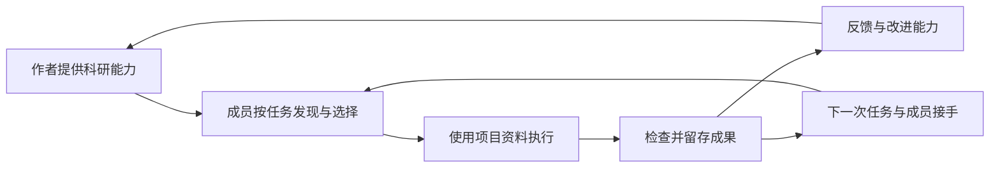

# 科研智能体平台 · Research Agent Platform

让科研小组在同一个地方找到合适的智能体、持续完成任务，并把资料、成果和有效方法留给下一次使用。

我们从自己小组的真实科研工作开始：写论文、准备项目申请书、整理材料、安排科研实习生和跟踪任务。小组成员通过浏览器访问同一个平台，智能体任务在常开服务器上执行；经过组内验证后，再沿相似需求和科研合作关系推广。

**产品形态是团队科研平台，技术路线是 DeepSeek Harness 运行底座＋科研插件＋团队服务。** 平台面向使用者与能力作者：研究者既可以使用智能体，也可以把自己的有效方法分享为别人能用的能力。

> 当前处于工程起步阶段。仓库已迁入本地项目/成果存储核心、十项科研 Skills、评测材料和 Harness 适配源码。统一网页、团队账号、长期记忆、服务器调度与完整科研执行尚未实现。当前可独立运行的是基础检查和本地演示。

## 为什么要做

我们希望验证三个问题：

1. 项目背景、资料和决策持续留存后，能否减少重复解释，让科研工作跨会话、跨成员继续？
2. 一个人总结出的任务能力，能否被另一个没有参与开发的人独立使用？
3. 平台能否通过任务匹配、可靠执行、结果检查和反馈，持续吸引使用者与能力作者？

长期方向是连接科研智能体供给与科研需求的平台。第一阶段用一个小组验证能力的生产、共享、使用和改进。内部使用有效，是继续验证的依据；跨团队复用和付费意愿需要后续单独检验。

## 我们希望第一版怎样工作

使用者进入项目，选择一个合适的智能体，提供或授权使用相关资料，提交任务。服务器执行任务并记录进展；需要人判断时暂停等待。成果保存到项目，确认过的决策沉淀为可修正的记忆。下一位成员可以利用这些积累继续工作。



建议先用一条“资料与依据整理→材料草稿或修改”的真实工作链，验证两项可以分别使用的能力；具体首发材料与采用标准仍需根据小组实际工作确定。十项已有 Skills 是候选资产，不等于十个已确定的首发智能体。

最小版本围绕项目、能力选择、后台任务、成果检查、项目记忆，以及作者发布和反馈形成完整过程。运行完成与成果被采用分别记录。个人长期偏好、周期任务等按首批需求决定优先级。详细范围见[产品规划](docs/product-plan.md)，需求与成效如何验证见[试点验证计划](docs/validation-plan.md)，推进顺序见[路线图](docs/roadmap.md)。

## 当前有什么

| 内容 | 状态 | 实际边界 |
|---|---|---|
| [科研数据核心](packages/research-core/README.md) | 已迁入，可独立构建与测试 | 本地 Project / Artifact 存取、来源信息、状态和哈希；无团队权限和跨进程事务 |
| [科研 Skills](agents/README.md) | 十项完整方法与参考材料，构建时统一打包 | 定义做事方法；执行仍需要相应检索、解析、分析等工具 |
| [Skills 加载包](packages/research-skills/README.md) | 可独立构建与测试 | 从同一份 Skill 源文件加载正文与本地参考目录 |
| [评测材料](evaluations/matrix.md) | 已迁入人工评测场景 | 不等于已完成模型效果评测；部分成功场景仍待补充 |
| [Harness 适配](integrations/deepseek-harness/README.md) | 迁入并调整源码，待完整联调 | 不进入默认构建；旧 SDK 版本及公开包依赖链存在安装问题 |
| 网页、成员权限、长期记忆、后台调度 | 规划中 | 尚未实现或部署 |

目前不会自动执行论文搜索、PDF 解析、引用验证或实验，也没有可登录的团队网页。目录和界面探索的取舍记录在[迁移说明](docs/migration.md)。

## 本地开始

建议 Node.js 24；要求 Node.js ≥ 22.19，pnpm 11.21.0。

```sh
git clone https://github.com/luoyan96/research-agent-platform.git
cd research-agent-platform
pnpm install --frozen-lockfile
pnpm run ci
pnpm demo
```

`pnpm run ci` 检查文档和 Skills 引用，构建两个基础包，执行类型检查与单元测试。`pnpm demo` 在系统临时目录创建演示项目、保存一份计划、通过新存储实例重新读取，并列出十项 Skills。演示打印文件位置，便于查看；不调用模型，不需要 API key。

Harness 源码适配单独位于 `integrations/deepseek-harness/`。主仓库的构建通过不代表 Harness 联调已经通过，接入状态和验证步骤见该目录 README。

## 仓库结构

```text
agents/                     十项 Skills 的唯一源文件、共享模板
packages/research-core/      不依赖 Harness 的科研对象与本地存储
packages/research-skills/    Skills 加载与打包
integrations/deepseek-harness/  可继续联调的 Harness 插件源码
evaluations/                人工评测矩阵与失败/边界案例
docs/                       产品规划、试点验证、路线图、架构和迁移记录
scripts/                    内容检查、资源打包和本地演示
.github/                    基础检查流程与协作模板
```

平台网页和服务将在对应里程碑建立；当前没有用占位页面表示功能完成。

## 怎样共同开发

- 围绕具体任务协作：明确负责人、预期结果和验证方式。
- 每项任务使用独立分支，通过 Pull Request 说明问题、改动和验证结果。
- 代码、Skills、产品决策和可公开的评测案例共同版本化；Skills 只修改 `agents/skills/`，避免重复维护精简版。
- 科研资料、私人记忆、运行数据与密钥保存在相应环境，不提交到源码仓库。
- `main` 保持可检查、可构建；部署是单独动作，提交代码不会自动部署。

详见[贡献指南](CONTRIBUTING.md)和[AI 开发约定](AGENTS.md)。

## 组内最小版本完成标准

甲发布一个智能体，乙在共享项目中独立使用并采用成果；关闭页面后任务仍受管理；成果与确认过的知识留存；下一次任务或另一成员能接着用；一次实际反馈能回到作者并得到处理。代码检查通过只是基础工程证据，这个使用过程还需要真实任务验证。

独立使用、下一次自然需求中的复用，以及包含检查返工和维护投入的实际收益，是进一步推广的依据。内部试用成功不直接证明外部作者愿意贡献、用户愿意付费或学校有采购需求。

我们使用并扩展 [DeepSeek Harness](https://github.com/deepseek-ai/deepseek-harness)，这是独立科研平台项目。源代码迁入位置、原始提交与已知限制见[迁移记录](docs/migration.md)和[来源说明](NOTICE.md)。
