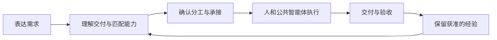

# Research Agent Platform · 任务与能力匹配平台

我们希望创建一个 AI 原生组织：用户提出要完成的事情，平台把合适的人和 AI 能力组织成可确认的协作方案，持续推进交付，并让获准留存的经验帮助下一次工作。

**长期方向是任务与能力匹配；当前从自己的科研小组入手，先把真实工作管起来。** 论文、项目、知识产权、材料和学生协作是任务场景，不是六套独立应用。初期验证组内有用，再验证相似课题组能否复用及谁愿意付费；跨行业市场和能力生态不预先当作成立。

成员通过统一浏览器入口协作。公共能力共同建设和使用，个人可以保留自己的工具与方法，只按约定交付结果。拟定技术路线仍为 **DeepSeek Harness 运行底座＋科研插件＋团队服务**，真实接入状态单独记录。

## 当前状态（2026-10-03）

网页、任务服务和邀请码网页注册已在现有 ECS 上线，当前运行代码提交 `ef8378077ace4b03a49f5958dafe4e204a5ed22a`，契约 **0.9.1**、迁移 **011**。首次实验室负责人使用维护者指定的单次开通码注册；登录后可自行管理成员邀请码和本实验室大模型设置。注册、登录和维护者重置密码均允许超过 8 个字符的密码（至少 9 个字符）。2026-10-03 修复了“发送”失败提示被页面内容遮住的问题；平台模型总开关已开启，但 IFRC 实验室尚未配置 API Key 或启用模型，因此仍不能生成 AI 方案。真实模型调用、成员试用和 P1 仍待完成。维护规则见[注册说明](docs/deployment/registration.md)，实际部署结果见[ECS 记录](docs/deployment/ecs.md)。以下 G5a 验收数字保留历史受测基线。

**G1—G3、G4a 和 G5a 已共同通过；下一步是实际运行与真实小组试用。产品第一阶段尚未完成。** 已能找回草案、查看本人待办及授权总览、记录成员承诺和可用时间，并在任务中处理依赖阻塞、安排变更、退出转交、取消撤权、附件与交付版本。

G5a 完整受测组合为 `1049ad300f4146045c36fd0b74aff63ed79e2aa6`，契约 **0.6.2**，回复契约 **1.0.0**。根 CI **258 项**，正式账号浏览器 7 组、历史浏览器 62 组，以及生产 HTTPS 协作、独立备份恢复均通过。详见 [G5a 共同复核](docs/development/reports/G5a-overall-2026-09-30.md)。该基线当时尚未合入 main、部署或通过真实小组试用；当前部署状态以上述最新记录为准。本轮无新增模型调用，既有真实 AI 证据见 G3/G4a 报告。

| 内容 | 当前能力与边界 |
| --- | --- |
| 网页与团队 API | F3 真实规划/同草案修改、授权查询、公共文本候选及后台运行已接通；保留人类协作 |
| 任务持久化 | 身份/会话、方案与承诺版本、附件引用、交付和验收由服务端保存 |
| 实验室全貌 | 授权全量计数、分页任务、草案历史与人员安排已接通；快照检查后手动刷新变化 |
| 协调与附件 | 已验收交付依赖、阻塞恢复、协商变更、转交、取消撤权及授权附件已验证；其余依赖类型和附件运维边界见 G2 报告 |
| [科研核心](packages/research-core/README.md) | 本地 Project/Artifact 与来源存取；不是多人平台的权威数据库 |
| [十项 Skills](agents/README.md)及[加载包](packages/research-skills/README.md) | 方法资源可构建和加载，不代表十项能力都能实际执行 |
| [Harness 适配](integrations/deepseek-harness/README.md) | 官方固定 0.2.0-rc.1 受限运行组合已安装并真实调用；旧六工具不用于团队 worker |
| 结论与公共方法 | 结论留存/授权复用、现有公共方法候选试跑与人工启停、本人请求及样例授权找回已共同验证；私人能力托管未开放 |

B5a/F5a 已共同通过账号维护、生产参考路径、恢复演练与首次使用验证；当时尚未部署。成员先读[一页使用指引](docs/first-use.md)。正式维护、启动与备份恢复见[B5a联调包](docs/development/b5a-handoff.md)及[阶段报告](docs/development/reports/B5a-backend-2026-09-30.md)。原业务权限规则见 [B4a 联调包](docs/development/b4a-handoff.md)；逐项真实证据及用量见 [G4a 报告](docs/development/reports/G4a-overall-2026-09-30.md)。根 CI 已覆盖新的 Harness runtime，真实模型专项仍须显式凭据。

## 第一阶段要完成什么

用户说“我有一项工作要安排”，平台帮助明确交付要求、匹配本人/成员/公共能力，确认后产生真实安排。成员接受后用自己的方式工作；系统记录卡点、交付和验收；下次任务只复用有权使用的资料与结论。

入口采用用户已选择的[对话中展开协作单](docs/design/adaptive-responses.md)：创建任务、查看进度、寻找可承接工作按需展示不同组件。实验室总览和任务详情保留，用户无需先搭流程或维护多套看板。


```mermaid
flowchart LR
    A[表达需求] --> B[理解交付与匹配能力]
    B --> C[确认分工与承接]
    C --> D[人和公共智能体执行]
    D --> E[交付与验收]
    E --> F[保留获准的经验]
    F --> B
```

完整目标见[产品规划 v0.4](docs/product-plan.md)。**当前优先读[第一阶段范围](docs/phase-one.md)**，它区分产品 P1、工程 G1 和暂缓功能。任务语义见[分配规则](docs/task-allocation.md)，实际收益见[试点计划](docs/validation-plan.md)，顺序见[路线图](docs/roadmap.md)。完整私人能力托管、公开市场、跨学校调度和学校行政系统不要求在 P1 一次完成。

契约 0.6.2 新增本人任务样例授权分页查询；0.7.0 新增邀请码注册；0.8.0 新增实验室负责人自助管理邀请码；0.9.0 新增本实验室大模型设置；当前 0.9.1 将密码最短长度统一为 9 个字符。数据库迁移截至 011。原前后端报告保留当时状态，以共同报告记录后续验收结论。

## 下一批怎样开发

下一步 **G5b：实际运行与小组试用**。负责人用单次开通码注册，完成模型配置交接，再选择一项当前真实任务开始。步骤见[试用启动说明](docs/pilot-launch.md)。成员使用已部署的 HTTPS 入口。

2026-10-01 已完成现有 ECS 的独立服务、HTTPS 与合成协作部署验证；[ECS 部署说明](docs/deployment/ecs.md)记录实际状态，[部署准备包](deploy/ecs/README.md)供后续维护参考。

[开发索引](docs/development/README.md)提供分工；[当前执行指令](docs/development/prompts.md#当前下一步-g5b)提供交接入口。采用包含 G5a 报告与试用说明的同一完整提交；前后端后续根据真实使用阻碍修复，不预排新的大型功能批次。

## 本地开始

建议 Node.js 24；要求 Node.js ≥ 22.19，pnpm 11.21.0。先检出交接指定的集成提交；单独 clone main 不保证包含本轮功能。

```sh
pnpm install --frozen-lockfile
pnpm run ci
```

真实 API、迁移、测试账号配置见[B5a 联调包](docs/development/b5a-handoff.md)，网页启动和环境变量见[前端说明](apps/web/README.md)。测试账号只用于合成验证；正式维护与恢复工具已验证，实际主机/证书/成员账号仍需按试用安排配置。

下方仅为独立合成开发环境的网页调试命令；生产 HTTPS 运行按 B5a 联调包配置，不混用 HTTP 开发入口。

```sh
# 开发 API 为 3100，APP_ORIGIN=http://127.0.0.1:4175
pnpm --filter @research-agent/web dev --port 4175
```

根 CI 检查文档、六个 workspace 子包（含 Harness runtime）的构建/类型、共享契约、单测、后端真实进程和前端生产隔离。浏览器回归和需要凭据的真实模型调用单独运行。基础存储演示仍可用 `pnpm demo`，F0 视觉演示为独立 `dev:demo` 模式，两者都不能证明真实 AI 可用。

## 仓库结构与协作

```text
apps/web/                      任务协作、真实 AI、授权复用与浏览器回归
apps/api/                      真实身份、权限、事务与任务 API
packages/contracts/            共享 Schema、路由与合成样例
packages/research-core/        本地科研对象与成果存储基础
packages/research-skills/      Skills 加载与打包
agents/skills/                 十项方法的唯一源文件
integrations/deepseek-harness/ 已验证的受限运行适配
evaluations/                   方法与效果验证材料
docs/                          规划、设计、开发指令与报告
```

每项工作用独立分支和可审查 PR，采用同一共同基线，不覆盖其他成员的工作目录。代码、方法和公开评测进入 Git；真实研究资料、私人方法、账号凭据和运行记录留在受控环境。提交代码不自动部署。

第一阶段成功取决于成员能独立承接、成果可用、协调与返工负担下降，以及下一次自然需求中的复用；不以任务数量、Agent 数量或 CI 通过代替。付费与跨组需求另行验证。

详见[贡献指南](CONTRIBUTING.md)、[AI 开发约定](AGENTS.md)、[迁移记录](docs/migration.md)和[来源说明](NOTICE.md)。我们使用并扩展 [DeepSeek Harness](https://github.com/deepseek-ai/deepseek-harness)，这是独立平台项目。
