# G0 总体验收：B0、F0 与本地集成

日期：2026-09-21。验收范围为基础服务、契约、三页预览、生产构建边界和本地组合；不包含 G1 真实任务协作，也不包含真实 AI 执行。

## 结论

**G0 暂不宣布全部通过。** B0 基础通过，本地 G0-I 集成验证通过；F0 有一项可复现的演示数据语义问题需要修正。没有发现需要推翻当前产品方向或重新设计三页结构的问题。

| 项目 | 本轮结论 | 依据与限制 |
| --- | --- | --- |
| G0-B | 通过 | 同一集成代码构建、类型检查、契约验证、服务测试与真实 HTTP 进程检查通过；不代表登录、任务分配、权限业务已实现 |
| G0-F | 部分通过，待修正 F0-01 | 三页、导航、错误/空/加载、窄屏、基础键盘检查通过；“我参与的”演示筛选与契约人员关系不一致 |
| G0-I | 本地验证通过 | 本地集成提交 `6cbad30a0faebe99ff6be71f5a165c366b27b4ad`；86 项测试通过，前后端应用均纳入根检查；尚未落入远端共同基线 |
| G0-H | 阻塞核查完成；真实运行未验证 | 固定版本依赖仍不可获取，未进行真实模型调用；依照验收文档，不阻塞 G1 人类协作，但 G3 必须实际接通 |

本轮没有合并任何 GitHub PR，没有推送，没有部署，没有进入 B1/F1。前后端原工作目录与分支没有被修改。配置冲突只在独立验收 worktree 处理，产品代码未作修复。

## 版本、环境与集成处理

| 来源 | 已检查版本 |
| --- | --- |
| [后端 PR #2](https://github.com/luoyan96/research-agent-platform/pull/2) | `4f4057b486b1570ac3a53782225e01df63d1136d` |
| [前端 PR #3](https://github.com/luoyan96/research-agent-platform/pull/3) | `84d80b92a367094e6de98ac5b3a816e58cc417d8` |
| 两个 PR 的共同目标分支 | `docs/product-requirements-review`，`ed36ac6ca1d2f342d7ca0f36a5c81a64734595ce` |
| 契约 | `0.1.0`；后端契约原提交 `b2289595f2cdae5c5d0de0dfd3921f48d6670f87`，前端已纳入相同内容 |
| 本地集成代码 | `6cbad30a0faebe99ff6be71f5a165c366b27b4ad`，两个父提交为上述 B0/F0 heads |
| 本机 | Windows、Node `24.19.0`、pnpm `11.21.0` |
| 前端交互预览 | 用户提供的 `http://127.0.0.1:4173/`，显式 demo 模式 |
| 集成生产预览 | 本轮启动的 `http://127.0.0.1:4175/`，验收结束关闭 |
| 独立目录 | `D:/deepseek-agent/research-agent-platform-g0-audit` |

GitHub 检查读取时，两个 PR 各自的 Linux Node 22.19、Linux Node 24、Windows Node 24 三组检查成功。此处的远端成功仅指各自 PR，不能代替组合后的验证。

两分支的 `packages/contracts` 内容完全一致。组合后的 `apps/web` 和 `packages/contracts` 相对于前端 head 没有内容差异，因此 4173 的界面检查对应同一套前端源代码；4175 验证的是组合后实际生成的生产包。

合并时有三个配置冲突，已在验收目录解决：

1. `package.json`：同时保留后端真实进程 smoke 与前端 `check:production`，CI 不能只取任意一侧。
2. `vitest.config.ts`：同时扫描 `packages/*/tests` 与 `apps/*/tests`。
3. `pnpm-lock.yaml`：保留 API 与 Web 的依赖，去掉合并后重复的 contracts importer，统一已有 YAML 2.8.3 peer 引用。

这些冲突是共享根配置的组合工作，不是服务运行缺陷。具体差异见[配置集成补丁](g0-audit-evidence/integration-config.patch)。该补丁以 B0 head 为比较基准，不应直接套到任意分支。

## 实际检查结果

| 操作 | 预期 | 本轮实际 | 结果 |
| --- | --- | --- | --- |
| `pnpm install --frozen-lockfile` | 锁文件可解析，不需要改写 | 成功安装 6 个 workspace 项目 | 通过 |
| 根 `pnpm run ci` | 所有应用与共享包受检 | build、typecheck、契约导出漂移检查、6 个测试文件、86 项测试全部通过 | 通过 |
| 后端真实进程 smoke | 不以 mock 代替服务启动 | 未迁移数据库 readiness=503；迁移/seed 可重复；两次真实 HTTP 启动=200；3 名合成成员持久化；没有预置登录 session | 通过 |
| 前端 production 检查 | 生产包没有 fixture 回退 | fixture 排除通过；显式 demo 生产构建被拒绝 | 通过 |
| 浏览器生产预览 | 无服务时真实提示不可用 | 访客身份、服务尚未接通、没有演示任务和场景切换器 | 通过 |
| fixture 角色与筛选诊断 | mine 与契约角色一致 | 期望 6 项，实际仅 3 项，详见 F0-01 | 失败 |
| Harness 固定依赖查询 | 核对现有接入阻塞 | npm 查询仍返回固定版本不存在；没有真实运行证据 | 阻塞/未验证 |

完整根检查输出：[integration-ci.txt](g0-audit-evidence/integration-ci.txt)。全量 CI 只执行一次；随后做针对性问题复现，没有用重复运行刷通过结果。最初 offline 安装因本地缓存缺包未完成，最终 frozen-lockfile 安装与 CI 成功，不把离线缓存缺失归为产品缺陷。

B0 的有效完成范围是服务基础：健康检查、数据库/文件依赖、迁移与合成 seed、共享契约、错误边界和事务基础。业务端点仍明确返回 `501 NOT_IMPLEMENTED`，认证仍为未实现；这些是 B1 及后续工作，不能把本轮通过描述成完整平台已可用。

## F0-01：个人任务筛选与演示人员关系不一致

优先级：**P2，建议在 G0 收口前修正。** 这是演示数据与筛选语义的问题，没有证据表明真实任务丢失或发生权限泄露；目前真实任务接口尚未接入。

复现路径：

1. 打开 4173 的正常演示场景，进入“实验室任务”，可以看到 6 项任务。
2. 切换“我参与的”，只显示 `proposal`、`data`、`meeting` 共 3 项。
3. 检查契约任务数据：6 项任务均继承 `initiatorId = member_A` 和 `reviewerId = member_A`，即演示成员洛。
4. 契约明确 `scope=mine` 包括发起人、负责人、参与者、验收人和待回应邀请对象。因此这组数据按角色关系应全部纳入，专利、实习生安排和论文返修被错误排除。

定位：

- [fixture-adapter.ts](../../../apps/web/src/fixture-adapter.ts)：第 30、38、71 行硬编码 `mine: false`；第 179–190 行读取并展开共享 base，却未覆盖发起人/验收人。
- [共享 fixtures](../../../packages/contracts/src/fixtures.ts)：第 9 行 base Task 的发起人、验收人均为 `member_A`。
- [契约路由](../../../packages/contracts/src/routes.ts)：第 32 行明确 mine 的人员关系范围。
- [main.ts](../../../apps/web/src/main.ts)：第 91 行依赖展示层 `t.mine` 过滤。

建议修复：让合成成员关系自洽，并从角色关系产生演示 mine 结果；也可修正 fixture 的真实参与关系，使 3 项筛选结果确有依据。不要为了维持三张卡片而任意更改共享契约。补一个基于独立角色样例的回归验证，覆盖发起/验收角色、无关成员和待回应邀请；F1 接入后以服务鉴权后的 `scope=mine` 响应为准。

诊断脚本：[check-fixture-scope.mjs](g0-audit-evidence/check-fixture-scope.mjs)（本机独立验收目录路径）；实际输出：[fixture-scope-evidence.json](g0-audit-evidence/fixture-scope-evidence.json)。它直接加载前端真实 fixture 模块并按契约角色计算，没有修改应用或使用模拟成功状态。

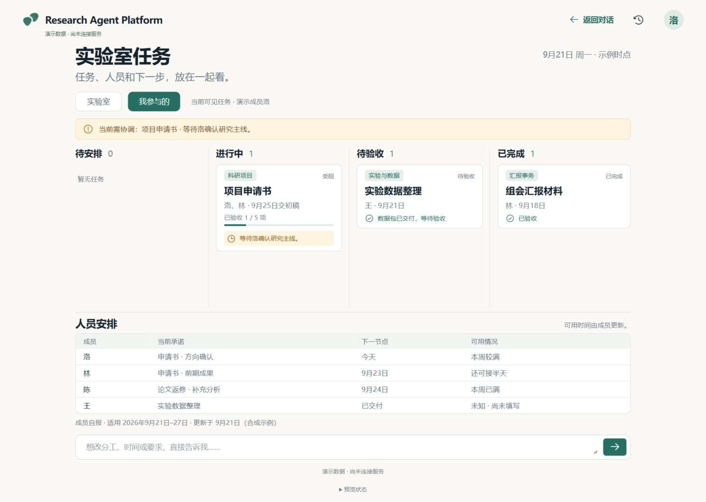

## 页面与流程复查

以下图片全部来自本轮实际浏览器操作，保存后逐张查看。桌面视口 1487×1058；窄屏视口 390×844。图片是可见视口截图，手机下方内容通过正常滚动访问，不把视口截图当成全页截图。

### 1. 从一句话开始：通过

保留单个主要输入入口，六种任务类型用于填入示例，没有新增侧栏或六套独立流程。输入后点击“帮我理清”明确说明尚未接通，未创建任务；Escape 关闭弹窗后回到原按钮，输入文字保留。资料上传、历史等入口不应被描述为已实现。

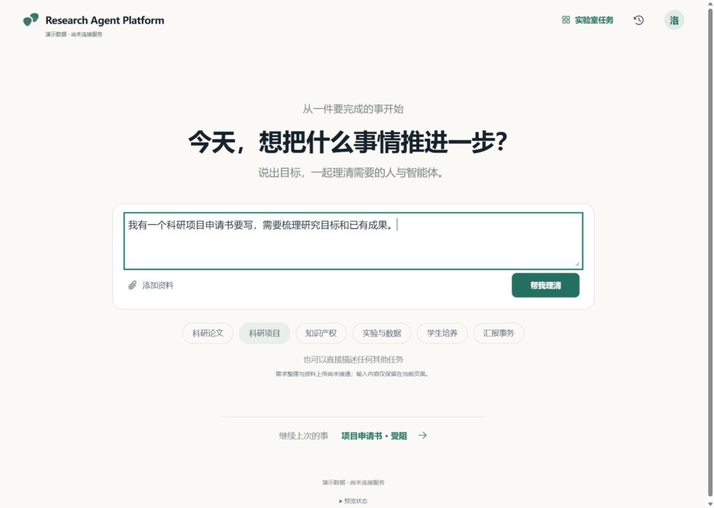

### 2. 看实验室全貌与人员：视觉和导航通过，个人筛选待修正

四列状态、需协调事项和人员承诺可同时看到。未知可用时间明确写“未知”，并显示自报适用周期和更新时间。页面符合此前确定的“简洁入口 + 可查看全貌”的方向。唯一确认的问题是 F0-01，详见上文。

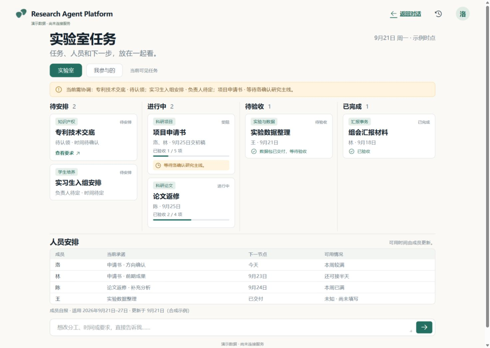

### 3. 查看任务卡点和下一步：通过

项目申请书详情清楚呈现研究主线待确认、前置依赖、交付和验收记录，区分建议时间与已确认时间；“已验收项数”没有冒充工时完成率。确认按钮只显示未实现说明，没有伪造执行成功或更新任务。这里只验证 F0 呈现，不是实际智能体调度与验收链路。

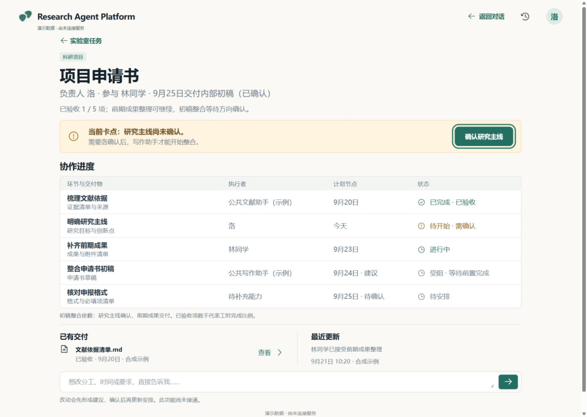

### 4. 空、失败与加载：通过

空数据时看板与成员安排均为空；不存在的任务显示不可见提示。失败有重试入口，重试后仍返回失败时不恢复旧演示任务。显式加载场景中可以返回对话入口，入口仍可输入。加载截图仅作为加载状态证据，不用来代表正常页面。

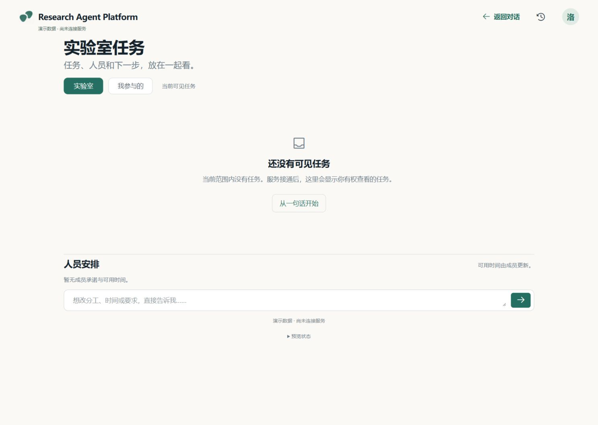

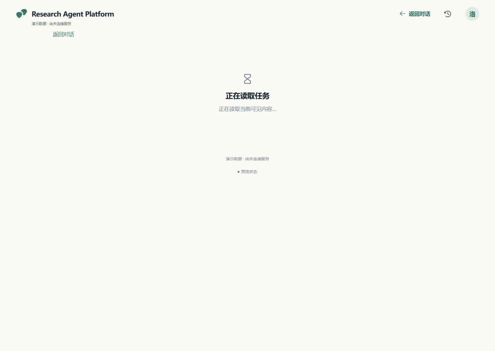

### 5. 窄屏、长标题与基础键盘：通过本轮检查

390px 视口下，入口控件可用，长标题折行；看板和详情的 document scrollWidth 均为 375px，没有全页横向溢出。表格是独立滚动容器，可由 Tab 聚焦，方向键操作后 `scrollLeft` 从 0 变为 120（容器宽 337，内容宽 730）。焦点轮廓可见；弹窗可 Escape 关闭并恢复触发点。

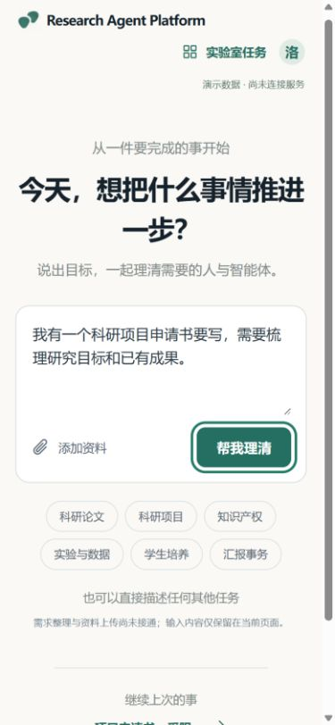

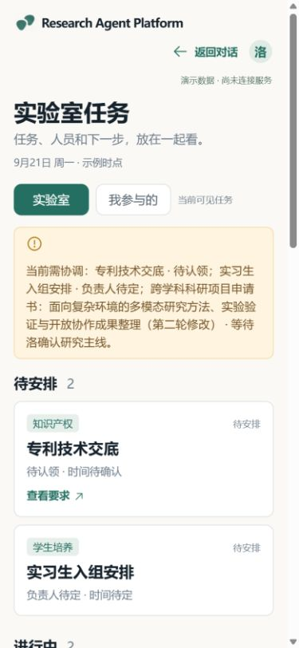

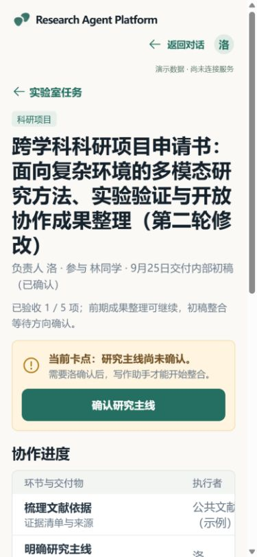

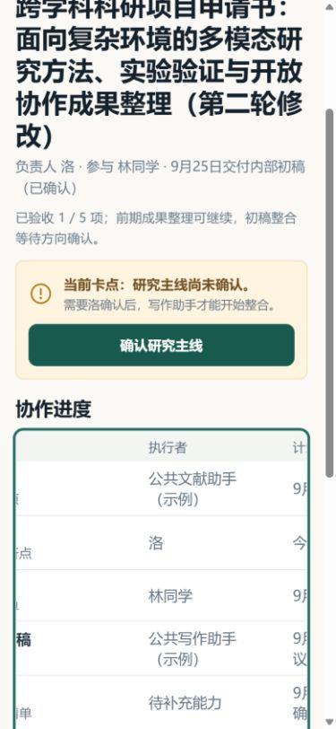

本轮未完成屏幕阅读器实测、精确颜色对比度测量、各移动浏览器/触屏设备矩阵，不能宣布完整无障碍合规。后续可评估长任务标题让手机“需协调”区域变高、表格需要横向浏览的使用负担，但当前未发现这些阻断 F0 操作。

### 6. 生产模式边界：通过

打开组合后生成的生产包，入口显示访客与服务未连接；看板显示读取失败和重试，没有演示成员、假任务、预览场景控件。该页面不代表真实前后端业务已经连接。

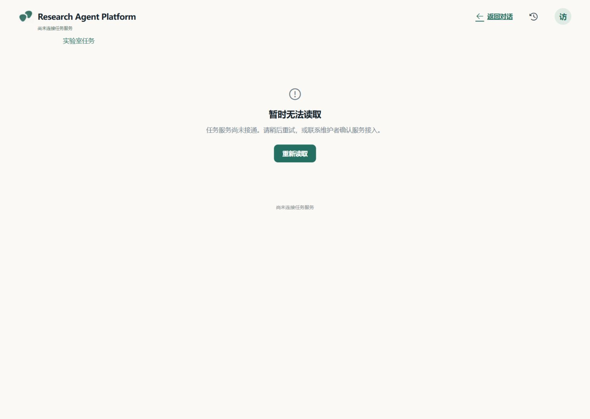

## Harness 状态

已核对现有 [B0 Harness 核查报告](../../../integrations/deepseek-harness/B0-verification.md)：源代码固定在 `47f943859bef60e4160492346772ded9b24f765a`，适配器需要 `@deepseek-ai/dsh-skill@0.1.0-rc.5` 等依赖。

本轮独立执行 `pnpm view @deepseek-ai/dsh-skill@0.1.0-rc.5 version --json`，得到 `ERR_PNPM_PACKAGE_NOT_FOUND` / `No matching version found`，退出码 1；pnpm 退出时同时出现 Windows libuv 断言信息。没有更换版本来绕过已固定的兼容性约定，也未进行真实模型调用。该单个必要依赖缺失已经足以阻止当前固定组合安装，但不能据此推断所有 Harness 版本都不可用。

“仍以 DeepSeek Harness 为运行底座”是架构选择；“固定组合已安装且真实执行通过”目前没有证据。G1/G2 可以先推进人类协作，G3 前要选定可获取且兼容的版本组合，完成独立安装和最小真实调用，再验证持续运行/恢复。

## 建议交接与收口顺序

1. 前端在 PR #3 修正 F0-01，更新角色/范围回归验证及 F0 报告；保持在 F0，不引入真实任务功能。
2. 由集成负责人采用本轮三个根配置的合并方式。不要简单选 ours/theirs，否则容易漏掉后端进程检查或生产 fixture 隔离检查。
3. 针对修订后的 head 更新集成提交，复核本问题、根 CI 和生产构建边界，并记录最终共同基线；在合并获授权前保持 PR 未合并。
4. G0 收口后按现有 [B1/F1 启动说明](../prompts.md) 推进“人的协作”：真实身份与权限、方案确认、邀请/接受/认领、交付/验收。前端优先贯通一个真实任务闭环，再扩展更多能力。

可直接交给前端 AI 的说明：

> 请仅修复 G0 总体验收的 F0-01：fixture 的六个 Task 全部继承 member_A 发起人和验收人，但“我参与的”被独立 mine 布尔值过滤为三项，违反 contracts 0.1.0 的 scope=mine 语义。让人员关系与筛选结果一致，增加针对角色范围的回归验证，更新 F0 报告并停在本阶段。不要接真实任务 API，不推进 F1，不自行改动冻结契约。请同时说明 PR #3 的最新提交和验证结果。

后端本轮无必须返工的 B0 问题；继续保持 B0 边界，并保留 Harness 阻塞说明。报告与图片可供双方复核，本轮没有向其他任务或 GitHub 自动发送这些交接内容。
