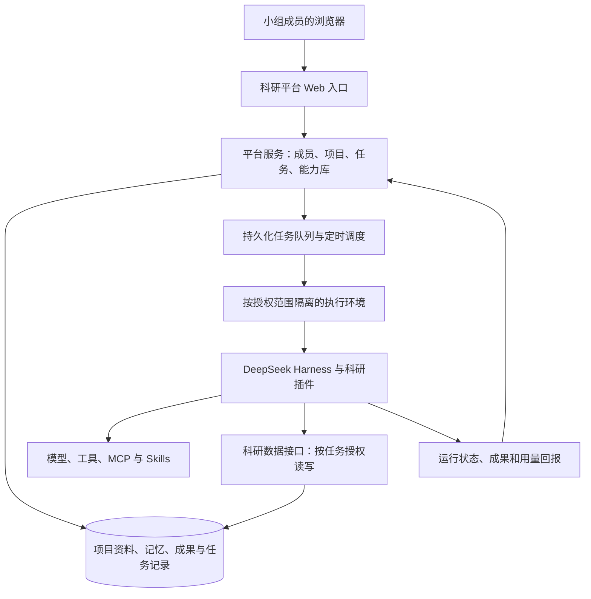

# 工程依据与迁移前盘点

本文件保留 2026-09-20 产品规划 v0.1 中的技术依据，供实施时复核。第二、三节描述当时的上游核查和迁移前探索，尤其“六项 skills”“需统一内容”等表述是历史状态；新仓库已迁入十项完整 Skills，当前交付范围以[README](../README.md)、[迁移记录](migration.md)和[Harness 适配说明](../integrations/deepseek-harness/README.md)为准。

当前产品范围、优先级和阶段标准由[产品规划](product-plan.md)与[路线图](roadmap.md)决定；这里的实现建议不构成已交付功能或新增产品承诺。本次文档审查未重新验证上游版本或运行环境。

## 1. 推荐的实现结构

这是目标分工示意，不代表上游现成提供了全部模块。

平台服务负责成员身份、项目归属、发布规则和任务生命周期。Harness 负责在指定执行环境中调用模型与工具。两者之间保留薄适配层，降低框架升级对科研数据和产品流程的影响。

对小组规模，先使用一个业务服务、一套事务数据库、文件存储和少量执行进程。数据库同时承担初期的任务队列与定时记录；只有实测容量或可靠性需要时才拆分更多基础设施。数据库与索引具体选型留给技术验证，避免在产品规划阶段引入不必要组件。

团队网页可以统一，执行权限必须明确。推荐按项目或权限范围隔离运行环境，并为每次任务使用独立工作目录与最小数据访问凭据。私人资料与共享项目不共用无约束的运行进程；是否采用每项目长期实例或每任务实例，由验证结果确定。

浏览器不直接访问全部 Harness 管理接口。登录、项目授权和工具访问要贯穿整个执行过程；仅在入口加一个密码，无法自动得到成员级项目隔离。

第一版能力发布限于组内维护者审核过的运行配置和依赖。后续允许外部作者贡献时，再扩大投稿、评测与发布流程；智能体条目的发布不直接授予服务器安装任意代码的权限。

### 原 v0.1 的持续运行设计

以下保留原设计范围；定时等能力是否进入首版，以当前[产品规划](product-plan.md)的 P0 / P1 划分为准。

- 浏览器断开：已接收任务继续由服务器管理，重连读取原任务。
- 无人在线：平台调度器仍可创建到期任务，按授权启动执行环境。
- 服务器重启：待执行任务可重新领取；执行中的任务先标记中断，再从已保存的可靠步骤恢复，或由人决定重跑。
- 已发生外部操作：记录结果与标识，避免恢复时重复执行；不能承诺任意脚本都能从崩溃的指令处无损继续。
- 人工介入：任务可以暂停等待，之后继续；同一个待确认步骤只接受一次有效处理。

## 2. 规划时核查的 Harness 能力和产品缺口

核查范围：本地源代码与文档、官方公开仓库文档。未启动运行环境、未执行真实模型任务，本表不是运行验收报告。

本地 Harness 根包版本为 `0.1.0-rc.5`，检出提交 `47f943859b`，日期 2026-08-13。官方上游已经存在后续变化，因此不把本地快照等同于当前最新版，也未在本轮执行更新。

| 能力 | 已观察到的基础 | 平台仍需负责的内容 |
|---|---|---|
| 插件与组合 | Harness 采用插件架构；支持 profile、bundle、工具及 UI 扩展 [S1][L1] | 科研对象、服务、接入规则与兼容测试 |
| 会话与日志 | 本地架构提供会话日志、持久化、恢复等机制 [L1] | 团队任务状态、成员归属、版本化成果、实际恢复验收 |
| 定时 | 官方 Schedule 文档明确依赖 live session；冷会话不执行，无独立冷会话调度 [S3] | 不依赖用户打开会话的任务调度与启动恢复 |
| 浏览器认证 | 当前上游有启动令牌换取浏览器 cookie，以及 Host/Origin 检查 [S2] | 成员账号、邀请、角色、项目权限与操作归属 |
| 网络入口 | Webserver 本身不负责统一 TLS 和所有路由的认证；部分路由由连接模块保护 [S4] | 团队服务入口和授权覆盖，不能将原开发入口直接视为团队平台 |
| 长期记忆接入 | 本地有默认关闭的第三方 memory MCP 示例 [L2] | 选择实际存储、项目范围、来源、冲突处理、编辑与删除、备份恢复 |
| 科研项目与成果 | 已有 `dsh-research-plugins` 本地原型 [L3][L4] | 多成员授权、团队任务、跨进程写入、版本迁移与长期记忆 |

官方仍将 Harness 标为开发者预览，存在兼容性变化 [S1]。实施前应选择并锁定一组经过验证的 Harness、插件和数据版本；升级通过兼容验证后再进入团队环境。

## 3. 迁移前的工作区盘点

### `dsh-research-plugins`

README 与代码表明已有本地 Project / Artifact 存取、来源信息、状态、时间和哈希，并注册了六项科研 skills。可以复用这些概念、部分逻辑和接入经验。[L3][L4]

当前数据类型未表达成员、角色和项目访问范围；文件存储的写入串行化位于进程内。这些代码不能直接当成已经完成多人协作和跨执行进程写入的平台存储。后续由统一数据服务负责权威数据与事务，插件通过接口读写。

现有 README 明确未包含完整的论文检索、PDF 解析、引用验证和实验执行；六项 skills 的存在不能视为六个已验收的科研智能体。

### `dsh-research-desktop`

已有项目与成果界面原型，部分科研能力标为待接入。[L5] 进一步读取 `ResearchWorkspace.tsx` 后确认：连接状态、健康检查和成果列表由前端常量呈现，创建项目按钮仍等待 API 桥接。这些页面可以作为布局与流程参考，不能视为已完成项目服务对接或真实健康检查。用户本次确定的是浏览器统一访问，因此桌面壳不作为第一版交付主线。

### 其他探索与复用优先级

以下是代码与文档盘点结果，尚未运行兼容性和任务质量验证。已有实现作为候选资产，由当前产品需求决定是否采用。

| 探索 | 可以带入新产品的积累 | 使用前需要明确的边界 |
|---|---|---|
| `dsh-research-plugins` | Project / Artifact 概念、工具注册、来源与状态记录 | 本地原型需要补齐团队权限、事务与跨执行进程访问 |
| `dsh-research-skills` | 十项科研工作方法、产物模板、评测场景 | 插件当前内置六项精简内容，需统一版本与内容来源；按实际任务评测后才发布为可运行能力 |
| `dsh-research-desktop` | 项目导航、成果视图与对话入口的界面探索 | 当前科研页面含固定状态与占位数据，需要真实服务对接 |
| `dsh-catnap-plugins` | Web 插件装配经验；任务看板、统计与设置的集成参考 | 多项功能来自第三方模块，需要重新核对适配关系；不能由任务看板外观推断后台调度能力 |
| `research-agent-portal` | 按任务发现能力、详情说明、筛选与比较的交互 | 当前为外链目录；新能力库需要关联真实运行、版本、作者和反馈 |
| `dsh-niulai`、`dsh-catnap-desktop` | 主题、插件生命周期及桌面包装经验 | 作为可选体验和后续分发参考，第一版 Web 平台不依赖这些外观与桌面功能 |

现有源码与探索保留。采用某个能力时先确认用户价值，再核实实现和依赖，最后验证真实任务；不按已投入的代码量决定产品范围。

### `deepseek-harness`

作为上游运行底座，优先使用扩展点和独立适配层。功能或接口缺口在技术验证阶段列明，再选择扩展或向上游反馈。本规划不要求修改已有仓库，也不将之前原型的任务清单直接当成本次产品范围。

## 依据与核查范围

官方网页于 2026-09-20 核查。设计建议、阶段和验收标准属于本规划的判断，不代表上游产品承诺。未用 GitHub 热度、内部试用或已有原型证明市场需求。

- [S1：DeepSeek Harness 官方仓库与开发者预览说明](https://github.com/deepseek-ai/deepseek-harness)
- [S2：当前上游浏览器连接与认证说明](https://github.com/deepseek-ai/deepseek-harness/blob/master/packages/client/connection/README.md)
- [S3：当前上游 Schedule 的会话运行条件](https://github.com/deepseek-ai/deepseek-harness/blob/master/docs/subsystems/schedule.md)
- [S4：当前上游 Webserver 职责与限制](https://github.com/deepseek-ai/deepseek-harness/blob/master/packages/host/webserver/README.md)
- [L1：本地 Harness 架构](https://github.com/deepseek-ai/deepseek-harness/blob/47f943859b/docs/architecture.md)
- [L2：本地第三方记忆接入示例](https://github.com/deepseek-ai/deepseek-harness/blob/47f943859b/examples/mcp-memory/README.md)
- [L3：现有科研插件的范围说明](https://github.com/luoyan96/dsh-research-plugins/blob/42bbeffd85ff76893d59d30080efebd7d7dbd92c/README.md)
- [L4：现有科研对象定义](https://github.com/luoyan96/dsh-research-plugins/blob/42bbeffd85ff76893d59d30080efebd7d7dbd92c/src/domain/index.ts)；[本地成果存储实现](https://github.com/luoyan96/dsh-research-plugins/blob/42bbeffd85ff76893d59d30080efebd7d7dbd92c/src/artifact-store.ts)
- [L5：现有科研桌面原型说明](migration.md)
- [L6：科研桌面页面的实际实现](migration.md)
- [L7：科研 skills 目录说明](https://github.com/luoyan96/dsh-research-skills/blob/5cd8a6a4940648bc3679a526da04fa722964c171/README.md)；[插件当前打包的 skills](https://github.com/luoyan96/dsh-research-plugins/blob/42bbeffd85ff76893d59d30080efebd7d7dbd92c/src/research-skills.ts)
- [L8：Catnap 工作台模块装配](migration.md)；[原门户范围说明](migration.md)

本文件保留规划时的工程依据与代码盘点，不作为当前产品范围或交付报告。后续代码迁入、基础检查与 Harness 联调范围见[迁移记录](migration.md)及[仓库 README](../README.md)。
