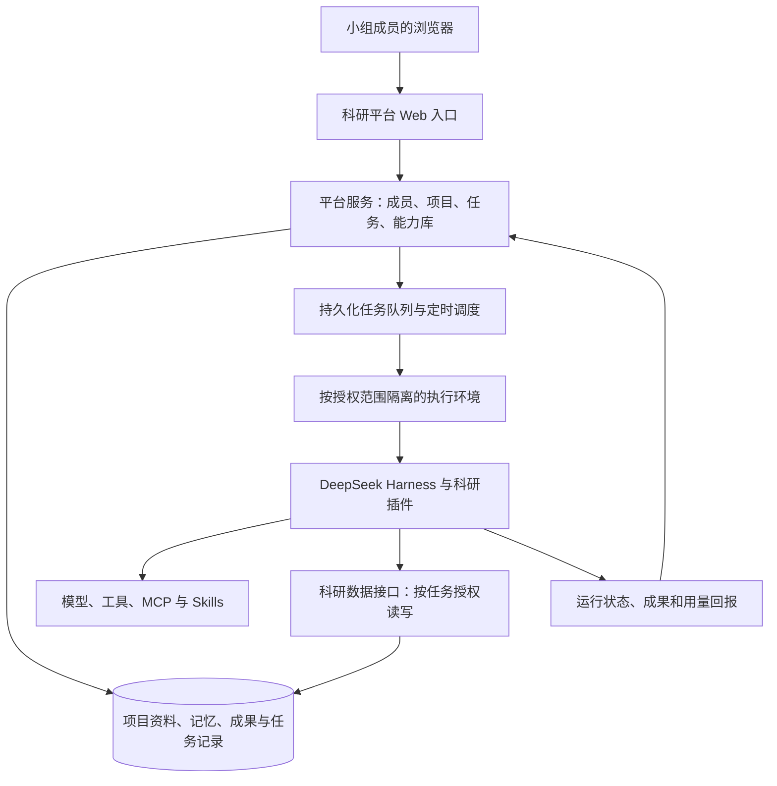

# 科研智能体平台产品规划 v0.1

日期：2026-09-20。状态：产品范围讨论稿。当前工程实现与验证范围以[仓库 README](../README.md)和[迁移记录](migration.md)为准。

## 1. 产品决策

**对研究人员交付一个完整、统一访问的团队平台；科研能力通过 DeepSeek Harness 插件和适配层实现。**

用户已确认：小组成员通过浏览器进入同一个平台，任务在常开服务器上运行。首批用户是自己的科研小组，随后验证非开发组员和其他课题组能否独立使用。

“平台”描述用户获得的产品与服务，“插件”描述技术扩展与部分能力的交付方式。两者可以同时成立。第一版需要统一入口、成员身份、项目资料、任务执行、记忆与能力共享；普通组员无需先安装 Harness、配置插件或管理服务器。

推荐形态：一个小组可用的 Web 应用、一组科研服务与 Harness 插件，以及独立于浏览器运行的任务执行服务。复用 Harness 的智能体执行机制、工具接入和会话能力；产品负责科研工作与团队协作的规则。

| 路线 | 适用情况 | 对当前目标的判断 |
|---|---|---|
| 只交付一个可安装的 Harness 科研插件 | 面向已经使用 Harness、愿意自己配置运行环境的人 | 可以作为开发者发行方式，难以单独满足组员统一访问、持续运行和团队共享的完整体验 |
| 自建整套平台和智能体运行框架 | 已有明确需求证明现有框架不适用 | 目前缺少必要性，会增加运行引擎维护工作 |
| **团队 Web 平台＋Harness 运行底座＋科研插件** | 小组统一访问，同时希望以后接入更多作者和能力 | **推荐；平台承担用户体验，插件保留扩展性** |

第一版优先独立提供精简的科研业务页面，评估复用 Harness 已有的对话、运行记录等界面组件。只有在其扩展点能满足成员身份和项目权限时才直接复用原界面；不能用界面隐藏代替服务端权限。是否复用组件在技术验证阶段确定，不影响产品形态。

## 2. 为什么做，以及要验证什么

起点是已经明确的个人与团队任务：写论文、写项目申请书、整理材料、安排实习生与跟踪进展。研究方向暂不限定。

待验证的产品假设有三项：

1. 项目资料、进度和决策被持续保存后，组员能够减少重复解释和查找，跨会话继续工作。
2. 一位研究者整理的任务能力，能被另一位未参与开发的研究者独立使用。
3. 平台提供的选择、运行、上下文和反馈机制，值得用户持续回来，也值得能力作者持续维护自己的智能体。

前两项在组内验证，第三项需要逐步引入非开发成员与外部作者。内部使用成功不能直接证明市场需求或商业可行性。

平台的基本循环：研究者提供能力 → 其他成员按任务发现并使用 → 产出与反馈留存 → 作者改进能力 → 在后续任务中复用。记忆和知识是支撑这个循环的基础，能力供需之间的实际复用决定平台价值。

## 3. 首批用户与责任

| 角色 | 主要诉求 | 第一版应能完成的动作 |
|---|---|---|
| 科研任务使用者 | 少解释背景、少切换工具、取得可检查的结果 | 选择项目和智能体，提供材料，查看进展、处理待确认事项、保存成果 |
| 智能体作者 | 把有效方法分享给别人，并知道哪里需要改进 | 提交能力说明和可运行配置，试运行、发布版本、查看使用反馈 |
| 项目负责人 | 知道任务状态和已有结论，方便成员接手 | 管理成员范围，确认项目记忆，查看任务与成果 |
| 平台维护者 | 服务稳定、任务可恢复、成本可理解 | 管理运行环境、版本、接入能力、用量、备份与恢复 |

同一个人可以兼任多个角色。组内试用应包含至少一位没有参与搭建的成员，观察独立使用过程。

## 4. 第一版核心使用过程

示例：围绕一个正在进行的申请项目，组员使用已有材料准备初稿，并交给另一位成员检查。

1. 项目负责人建立项目，邀请成员，添加已有材料和已确认的项目背景。
2. 使用者进入能力库，按任务选择智能体，查看它需要的材料、交付物、局限、维护者和版本。
3. 使用者选择本次允许使用的资料与记忆，提交任务；平台展示预计执行方式和用量限制。
4. 任务由服务器执行。关闭页面后任务仍可继续，重新打开时看到服务器记录的真实状态。
5. 需要人的判断时，任务进入待确认状态；使用者补充材料或决定方向后继续。
6. 结果保存为项目成果，标明来源、版本、生成任务和智能体版本。使用者给出是否可用及修改意见。
7. 新决策可以保存为项目记忆；模型生成的待确认判断与已确认内容区分记录。
8. 另一位有项目权限的成员选择检查类智能体，读取授权材料和成果，继续工作。

这一过程同时检验任务连续性、知识留存、成员接手和智能体交叉使用，不限定必须从申请书场景开始。

## 5. v0.1 产品范围

| 模块 | 第一版范围 | 验收依据 |
|---|---|---|
| 成员与项目 | 邀请加入；个人空间与项目空间；负责人、成员、只读访问；由服务端检查访问范围 | 未被授权的人不能通过页面、直接接口或智能体工具获取项目资料 |
| 任务中心 | 提交、排队、运行、等待输入、完成、失败、中断、取消；进度与运行记录；有限重试和单任务用量限制 | 关闭浏览器不丢任务；重连不重复创建；异常状态可见 |
| 持续执行 | 常驻执行服务；任务持久化；一次性定时与简单周期任务；启动时扫描待执行任务 | 所有用户离线时也能触发；服务重启后可恢复待执行任务，正确处理运行中断 |
| 资料与成果 | 上传常用材料；正文与元信息留存；来源、作者、时间、版本；检索和导出 | 能找到对应原文与版本；支持下一次任务复用和成员交接 |
| 长期记忆 | 个人偏好、项目背景、确认过的决策；查看、修改、失效和共享范围 | 新会话能调用相关记忆；旧决策不会覆盖更新后的决定；不同项目不串用 |
| 智能体能力库 | 少量可运行条目；任务说明、输入输出、版本、作者、局限和反馈；组内发布与停用 | 非作者能够选到合适能力并独立使用；运行记录能关联到具体版本 |

第一版页面建议：工作首页、项目、任务、智能体库。资料、成果、项目记忆放在项目内；个人记忆与成员设置按使用场景呈现。首页优先展示正在运行的任务、待处理事项和最近项目。

资料格式先支持团队实际使用最多的类型。PDF、Word 等文档解析结果需能回看原文；解析失败应明确显示，不能只保留一段不可核对的摘要。具体格式覆盖由首批真实材料决定。

第一版可由维护者通过受控配置发布智能体，作者有可理解的提交与反馈流程即可；完整可视化编排器可后置。

## 6. 记忆、知识和方法如何留存

| 对象 | 保存内容 | 使用规则 |
|---|---|---|
| 任务状态 | 当前阶段、工具结果、待处理事项、运行日志 | 关联一个任务及其执行尝试，支撑恢复与追踪 |
| 个人记忆 | 偏好、背景、自行保存的长期信息 | 默认属于本人，使用者可以查看、修正和删除 |
| 项目记忆 | 目标、约束、重要决策及原因、未解决问题 | 对授权成员开放，记录来源和生效版本 |
| 项目知识 | 文献、数据、笔记、材料、已交付成果 | 原始资料是依据，检索索引和摘要可重建 |
| 可复用能力 | skills、执行配置、所需工具、输入输出要求、示例 | 版本化发布；记录维护者及验证结果 |

每条可供后续任务使用的长期记忆至少记录：归属范围、内容、来源、更新时间、状态。重要项目判断采用“候选、已确认、已替代”等状态，并保留由谁确认或修正的记录。

读取规则是按成员、项目、任务相关性取用。不能把全部聊天记录自动当成项目事实，也不能把所有人的私人资料放进一个无边界的共享记忆库。

数据由平台管理和导出，Harness 通过受控接口取得本次任务所需的信息。模型是否使用了某项关键材料，应能从运行记录中追踪。知识保留、索引重建和模型训练是不同的事情；本阶段的积累依靠数据与流程，不预设需要训练模型。

## 7. 平台、插件、skill 与智能体的关系

| 名称 | 在本产品中的含义 |
|---|---|
| 平台 | 用户访问的整体产品：成员、项目、任务、资料、记忆、能力发现与反馈 |
| Harness 插件 | 工程扩展单元，向运行环境加入工具、服务或界面能力 |
| Skill | 可复用的方法说明及配套资源，可被一个或多个智能体使用 |
| 平台上的智能体条目 | 面向任务的可运行能力，包含输入输出、执行配置、所需工具与 skills、资料访问范围、版本、作者和使用说明 |

因此，一个插件可以支撑多个智能体；一个智能体也可能使用多个插件与 skills。仅有一份 skill 文件不足以承诺任务已经能够完整运行。

首批建议选择 2–3 类真实任务验证平台，不规定某个研究方向。候选可以覆盖材料检查与写作、资料整理与证据核对、任务分解与进展汇总。选择依据是近期确实会用、输入能取得、结果能评判、存在跨成员复用的机会。

## 8. 推荐的实现结构

这是目标分工示意，不代表上游现成提供了全部模块。

平台服务负责成员身份、项目归属、发布规则和任务生命周期。Harness 负责在指定执行环境中调用模型与工具。两者之间保留薄适配层，降低框架升级对科研数据和产品流程的影响。

对小组规模，先使用一个业务服务、一套事务数据库、文件存储和少量执行进程。数据库同时承担初期的任务队列与定时记录；只有实测容量或可靠性需要时才拆分更多基础设施。数据库与索引具体选型留给技术验证，避免在产品规划阶段引入不必要组件。

团队网页可以统一，执行权限必须明确。推荐按项目或权限范围隔离运行环境，并为每次任务使用独立工作目录与最小数据访问凭据。私人资料与共享项目不共用无约束的运行进程；是否采用每项目长期实例或每任务实例，由验证结果确定。

浏览器不直接访问全部 Harness 管理接口。登录、项目授权和工具访问要贯穿整个执行过程；仅在入口加一个密码，无法自动得到成员级项目隔离。

第一版能力发布限于组内维护者审核过的运行配置和依赖。后续允许外部作者贡献时，再扩大投稿、评测与发布流程；智能体条目的发布不直接授予服务器安装任意代码的权限。

### 持续运行的明确承诺

- 浏览器断开：已接收任务继续由服务器管理，重连读取原任务。
- 无人在线：平台调度器仍可创建到期任务，按授权启动执行环境。
- 服务器重启：待执行任务可重新领取；执行中的任务先标记中断，再从已保存的可靠步骤恢复，或由人决定重跑。
- 已发生外部操作：记录结果与标识，避免恢复时重复执行；不能承诺任意脚本都能从崩溃的指令处无损继续。
- 人工介入：任务可以暂停等待，之后继续；同一个待确认步骤只接受一次有效处理。

## 9. 已核实的 Harness 能力和产品缺口

核查范围：本地源代码与文档、官方公开仓库文档。未启动运行环境、未执行真实模型任务，本表不是运行验收报告。

本地 Harness 根包版本为 `0.1.0-rc.5`，检出提交 `47f943859b`，日期 2026-08-13。官方上游已经存在后续变化，因此不把本地快照等同于当前最新版，也未在本轮执行更新。

| 能力 | 已观察到的基础 | 平台仍需负责的内容 |
|---|---|---|
| 插件与组合 | Harness 采用插件架构；支持 profile、bundle、工具及 UI 扩展 [S1][L1] | 科研对象、服务、接入规则与兼容测试 |
| 会话与日志 | 本地架构提供会话日志、持久化、恢复等机制 [L1] | 团队任务状态、成员归属、版本化成果、实际恢复验收 |
| 定时 | 官方 Schedule 文档明确依赖 live session；冷会话不执行，无独立冷会话调度 [S3] | 不依赖用户打开会话的任务调度与启动恢复 |
| 浏览器认证 | 当前上游有启动令牌换取浏览器 cookie，以及 Host/Origin 检查 [S2] | 成员账号、邀请、角色、项目权限与操作归属 |
| 网络入口 | Webserver 本身不负责统一 TLS 和所有路由的认证；部分路由由连接模块保护 [S4] | 团队服务入口和授权覆盖，不能将原开发入口直接视为团队平台 |
| 长期记忆接入 | 本地有默认关闭的第三方 memory MCP 示例 [L2] | 选择实际存储、项目范围、来源、冲突处理、编辑与删除、备份恢复 |
| 科研项目与成果 | 已有 `dsh-research-plugins` 本地原型 [L3][L4] | 多成员授权、团队任务、跨进程写入、版本迁移与长期记忆 |

官方仍将 Harness 标为开发者预览，存在兼容性变化 [S1]。实施前应选择并锁定一组经过验证的 Harness、插件和数据版本；升级通过兼容验证后再进入团队环境。

## 10. 对现有工作区的处理建议

### `dsh-research-plugins`

README 与代码表明已有本地 Project / Artifact 存取、来源信息、状态、时间和哈希，并注册了六项科研 skills。可以复用这些概念、部分逻辑和接入经验。[L3][L4]

当前数据类型未表达成员、角色和项目访问范围；文件存储的写入串行化位于进程内。这些代码不能直接当成已经完成多人协作和跨执行进程写入的平台存储。后续由统一数据服务负责权威数据与事务，插件通过接口读写。

现有 README 明确未包含完整的论文检索、PDF 解析、引用验证和实验执行；六项 skills 的存在不能视为六个已验收的科研智能体。

### `dsh-research-desktop`

已有项目与成果界面原型，部分科研能力标为待接入。[L5] 进一步读取 `ResearchWorkspace.tsx` 后确认：连接状态、健康检查和成果列表由前端常量呈现，创建项目按钮仍等待 API 桥接。这些页面可以作为布局与流程参考，不能视为已完成项目服务对接或真实健康检查。用户本次确定的是浏览器统一访问，因此桌面壳不作为第一版交付主线。

### 其他探索与复用优先级

以下是代码与文档盘点结果，尚未运行兼容性和任务质量验证。已有实现作为候选资产，由当前产品需求决定是否采用。

| 探索 | 可以带入新产品的积累 | 使用前需要明确的边界 |
|---|---|---|
| `dsh-research-plugins` | Project / Artifact 概念、工具注册、来源与状态记录 | 本地原型需要补齐团队权限、事务与跨执行进程访问 |
| `dsh-research-skills` | 十项科研工作方法、产物模板、评测场景 | 插件当前内置六项精简内容，需统一版本与内容来源；按实际任务评测后才发布为可运行能力 |
| `dsh-research-desktop` | 项目导航、成果视图与对话入口的界面探索 | 当前科研页面含固定状态与占位数据，需要真实服务对接 |
| `dsh-catnap-plugins` | Web 插件装配经验；任务看板、统计与设置的集成参考 | 多项功能来自第三方模块，需要重新核对适配关系；不能由任务看板外观推断后台调度能力 |
| `research-agent-portal` | 按任务发现能力、详情说明、筛选与比较的交互 | 当前为外链目录；新能力库需要关联真实运行、版本、作者和反馈 |
| `dsh-niulai`、`dsh-catnap-desktop` | 主题、插件生命周期及桌面包装经验 | 作为可选体验和后续分发参考，第一版 Web 平台不依赖这些外观与桌面功能 |

现有源码与探索保留。采用某个能力时先确认用户价值，再核实实现和依赖，最后验证真实任务；不按已投入的代码量决定产品范围。

### `deepseek-harness`

作为上游运行底座，优先使用扩展点和独立适配层。功能或接口缺口在技术验证阶段列明，再选择扩展或向上游反馈。本规划不要求修改已有仓库，也不将之前原型的任务清单直接当成本次产品范围。

## 11. 交付顺序与阶段验收

时间需要结合组员工程能力、每周投入和服务器条件估算。先按通过条件推进，暂不承诺固定开发周数。

| 阶段 | 交付物 | 通过条件 |
|---|---|---|
| M0：技术与需求验证 | 首批真实任务清单；一个纵向运行样例；版本与接口选择记录 | 页面关闭后任务仍受管理；冷会话可由平台触发；服务重启后记录可恢复；两名成员的项目权限有效 |
| M1：组内平台 v0.1 | 成员、项目、任务、资料、记忆和小型能力库 | 完成“选择能力→执行→保存成果→下一次复用”；至少两名成员能够交叉使用能力 |
| M2：非开发成员试用 | 使用记录、失败原因、净节省时间、能力更新反馈 | 未参与开发的人能独立完成任务，并在下次同类需求中主动回来 |
| M3：跨课题组验证 | 少量外部用户与作者、相同能力跨组使用 | 不逐组重写核心产品；外部作者能贡献能力，并被其他人持续使用 |

M0 的样例应使用少量可检查的材料贯穿整个过程，不先建设空白的通用基础设施。下面的技术验证直接决定是否进入 M1：

1. **会话与任务对应**：一个平台任务能关联 Harness 会话、执行尝试、输出和取消状态。
2. **记忆复用**：新会话准确取回本项目的确认信息，同时不取得无权读取的项目资料。
3. **离线与恢复**：浏览器断开、执行进程停止、服务重启三种情况分别验证，不能用一次刷新页面替代。
4. **成员与工具授权**：通过直接接口与模型工具访问都遵守项目范围。
5. **作者发布**：新版本保留旧运行记录的关联；能力停用后不继续创建新任务。

建议组内验收选取至少两位成员、两个项目和两类任务；至少一位成员不参与平台开发。这是试点设计建议，不是市场规模证据。

## 12. 分工、成本与扩张依据

小组按可验收结果分工。一人可兼任多个责任，但每个责任需要有明确负责人。

| 责任 | 主要产出 |
|---|---|
| 产品与科研质量 | 真实任务、结果标准、使用观察、范围取舍；可由发起人负责 |
| 平台与运行 | 成员项目服务、任务执行、恢复、部署与备份 |
| 科研能力 | 智能体与 skills、示例、验证、版本维护 |
| 体验与试用 | 非开发成员使用流程、接入说明、问题记录、反馈处理 |

总成本应同时记录模型调用、外部数据服务、服务器与存储、人工检查返工及维护时间。免费试用时也记录这些成本，后续才能判断个人付费、课题组付费或机构采购是否成立。

优先观察：

- 用户任务完成率与结果是否真正采用，区分作者协助完成和独立完成。
- 下一次同类任务是否重复使用，按任务自然频率观察，不强求每日活跃。
- 非作者对他人智能体的有效使用次数，以及跨项目、跨组复用情况。
- 记忆的正确取用、过期内容与跨范围误取情况。
- 扣除人工检查、返工和维护后的净收益，以及每项有效成果的成本。
- 作者是否根据真实反馈改进能力；外部用户是否愿意承担合理费用。

从一个小组到另一个小组，应优先沿相似任务和合作关系扩散。面向全校个人用户的自然增长与学校统一采购分别验证。

## 13. 后续范围与待决事项

公开市场、支付分成、全校统一身份接入、大规模组织管理、任意第三方代码安装、跨智能体全自动调度、自主训练模型、完整论文编辑器和实习生管理系统，留到相应需求与使用证据出现后评估。

当前仍需在实施前确定：

- 首批参与人数、工程负责人及每周投入。
- 常开服务器的操作系统、现有资源和访问范围。
- 团队共用模型额度还是个人额度，及允许使用的外部服务。
- 首批 2–3 类实际任务、真实材料与结果判断标准。

这些问题影响排期和技术细节；目前已经可以确定产品采用统一 Web 平台、Harness 底座和科研插件扩展的方向。

## 依据与核查范围

官方网页于 2026-09-20 核查。设计建议、阶段和验收标准属于本规划的判断，不代表上游产品承诺。未用 GitHub 热度、内部试用或已有原型证明市场需求。

- [S1：DeepSeek Harness 官方仓库与开发者预览说明](https://github.com/deepseek-ai/deepseek-harness)
- [S2：当前上游浏览器连接与认证说明](https://github.com/deepseek-ai/deepseek-harness/blob/master/packages/client/connection/README.md)
- [S3：当前上游 Schedule 的会话运行条件](https://github.com/deepseek-ai/deepseek-harness/blob/master/docs/subsystems/schedule.md)
- [S4：当前上游 Webserver 职责与限制](https://github.com/deepseek-ai/deepseek-harness/blob/master/packages/host/webserver/README.md)
- [L1：本地 Harness 架构](https://github.com/deepseek-ai/deepseek-harness/blob/47f943859b/docs/architecture.md)
- [L2：本地第三方记忆接入示例](https://github.com/deepseek-ai/deepseek-harness/blob/47f943859b/examples/mcp-memory/README.md)
- [L3：现有科研插件的范围说明](https://github.com/luoyan96/dsh-research-plugins/blob/42bbeffd85ff76893d59d30080efebd7d7dbd92c/README.md)
- [L4：现有科研对象定义](https://github.com/luoyan96/dsh-research-plugins/blob/42bbeffd85ff76893d59d30080efebd7d7dbd92c/src/domain/index.ts)；[本地成果存储实现](https://github.com/luoyan96/dsh-research-plugins/blob/42bbeffd85ff76893d59d30080efebd7d7dbd92c/src/artifact-store.ts)
- [L5：现有科研桌面原型说明](migration.md)
- [L6：科研桌面页面的实际实现](migration.md)
- [L7：科研 skills 目录说明](https://github.com/luoyan96/dsh-research-skills/blob/5cd8a6a4940648bc3679a526da04fa722964c171/README.md)；[插件当前打包的 skills](https://github.com/luoyan96/dsh-research-plugins/blob/42bbeffd85ff76893d59d30080efebd7d7dbd92c/src/research-skills.ts)
- [L8：Catnap 工作台模块装配](migration.md)；[原门户范围说明](migration.md)

本文件记录产品规划及规划时的代码盘点，不作为当前交付报告。后续代码迁入、基础检查与 Harness 联调范围见[迁移记录](migration.md)及[仓库 README](../README.md)。
